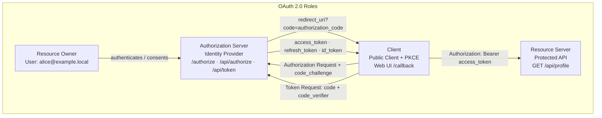
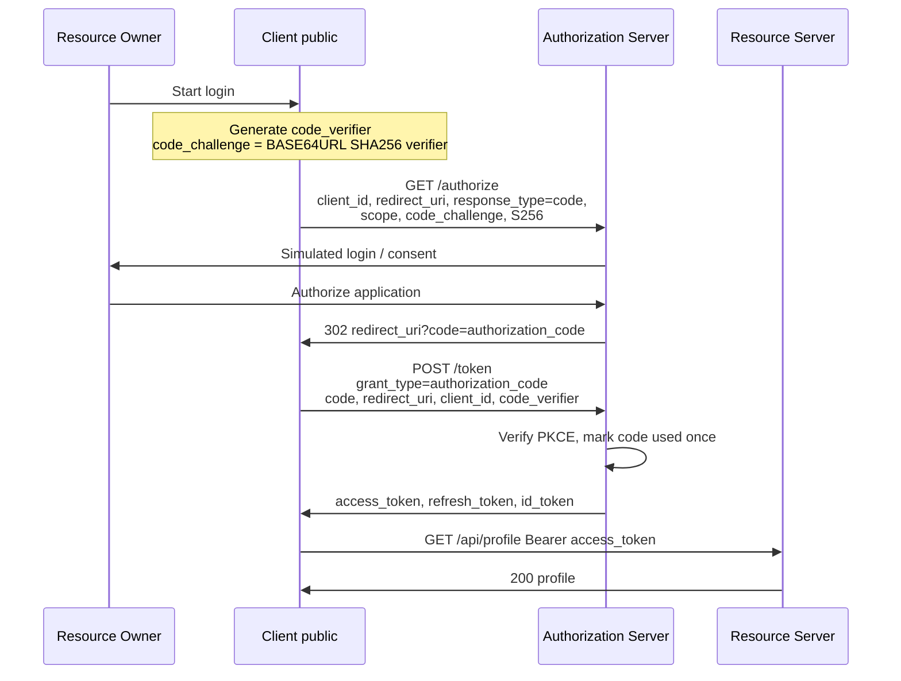
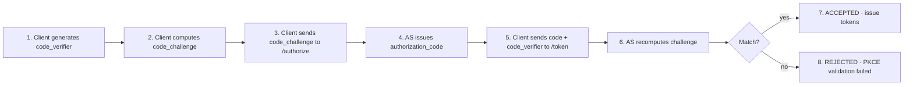
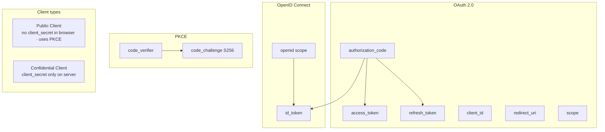
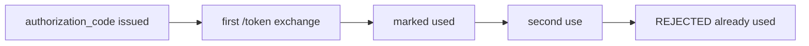
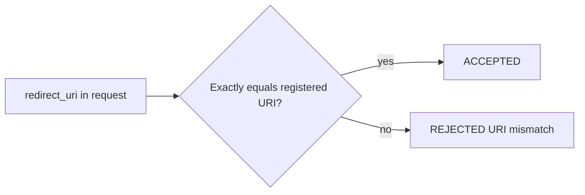

# Architecture — OAuth 2.0 / OIDC Learning Lab

Educational diagram of the local lab. All entities run inside one Next.js app on `localhost:3000`, but are conceptually separated.

> This is a **local educational lab**. Login is simulated (no real password). JWTs use a lab secret. Do not use in production.

---

## Four OAuth 2.0 roles (+ OIDC)

**OpenID Connect (OIDC)** sits on top of OAuth 2.0: when `scope` includes `openid`, the Authorization Server also issues an **id_token** (identity). The **access_token** remains the credential for calling the Resource Server.

---

## Authorization Code Flow (happy path)

---

## PKCE step by step

---

## Concepts map

### authorization_code — single use

### redirect_uri — exact match

### Public vs Confidential Client

| Type | Secret | This lab |
|------|--------|----------|
| **Public Client** | Must NOT ship `client_secret` in the browser | **lab-client** uses **PKCE** |
| **Confidential Client** | Keeps `client_secret` on a trusted server | Secret exists in config **only for teaching**; not used by the browser flow |

---

## Where security controls live

| Control | What it enforces | Implementation |
|---------|------------------|----------------|
| redirect_uri validation | Exact match to registered URI | [`src/lib/oauth.ts`](../src/lib/oauth.ts) `validateAuthorizeParams` |
| PKCE validation | `SHA256(code_verifier)` == stored challenge | [`src/lib/oauth.ts`](../src/lib/oauth.ts) + [`src/lib/pkce.ts`](../src/lib/pkce.ts) |
| authorization code single-use | Second exchange rejected | `record.used` in store |
| token expiration | Short-lived access / code TTLs | [`src/lib/config.ts`](../src/lib/config.ts) + checks in oauth/profile |
| refresh token handling | Rotation + reuse detection | `handleRefreshTokenGrant` |
| scope validation | Allowed scopes; offline_access → refresh | authorize + mintTokensFor |
| client validation | Known `client_id`; code binding | authorize + token grants |

---

## Lab components (same process)

| Logical role | Routes / UI |
|--------------|-------------|
| Client | `/`, `/callback` |
| Authorization Server / IdP | `/authorize`, `/api/authorize`, `/api/token` |
| Resource Server | `/api/profile` |
| Observability | Event Log, Request Inspector, terminal `[AUTH]` / `[PKCE]` / `[TOKEN]` / `[SECURITY]` |
